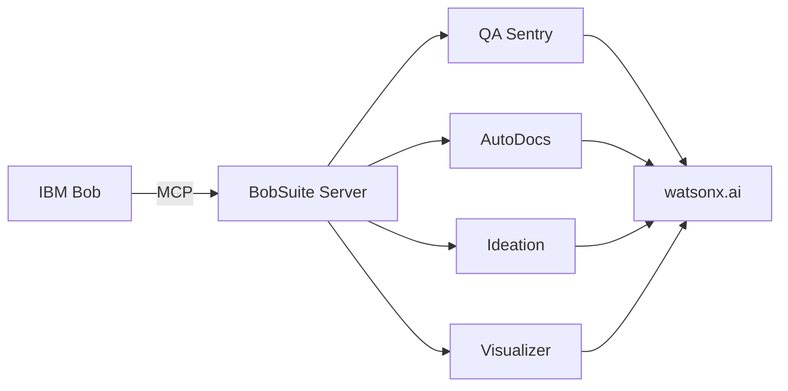

# BobSuite MCP - AI Development Toolkit for IBM Bob

  

**Extends IBM Bob with enterprise-grade code analysis, documentation generation, and visual architecture mapping powered by IBM watsonx.ai.**

🎥 [Demo Video](#) | 📖 [Full Docs](docs/) | 🚀 [Quick Start](#quick-start)

---

## What It Does

BobSuite adds 4 AI-powered engines to IBM Bob via Model Context Protocol (MCP):

| Engine | Purpose | Key Feature |
|--------|---------|-------------|
| **🛡️ QA Sentry** | Code quality analysis | Multi-agent debate (Finder vs. Critic) |
| **📚 AutoDocs** | Documentation generation | 12 doc types, concurrent processing |
| **💡 Ideation** | PRD generation | Conversation → structured specs |
| **🎨 Visualizer** | Architecture diagrams | Auto-generated Mermaid diagrams |

**Performance**: Scans 10K lines in ~30s • 60% cache hit rate • Handles files up to 50K lines

---

## Quick Start

```bash
# 1. Setup
git clone https://github.com/your-org/bobsuite.git
cd bobsuite/mcp_server
python -m venv venv && source venv/bin/activate  # Windows: venv\Scripts\activate
pip install -r requirements.txt

# 2. Configure
cp .env.example .env
# Add your IBM_API_KEY and PROJECT_ID to .env

# 3. Test
python tests/test_watsonx.py

# 4. Add to IBM Bob MCP settings (~/.bob/mcp_settings.json)
{
  "mcpServers": {
    "bobsuite": {
      "command": "python",
      "args": ["/absolute/path/to/bobsuite/mcp_server/server.py"],
      "env": {
        "IBM_API_KEY": "your_key",
        "PROJECT_ID": "your_project_id"
      }
    }
  }
}
```

**Prerequisites**: Python 3.8+, IBM Cloud account with watsonx.ai access, IBM Bob IDE

---

## Usage Examples

### Scan Code Quality
```
Bob, scan dataset_balancia/src/app/actions.ts for all issues and generate tests
```
**Output**: Bugs, vulnerabilities, quality issues + auto-generated test cases

### Generate Documentation
```
Bob, generate full documentation for mcp_server/lib/qa_sentry/
```
**Output**: API docs, tutorials, troubleshooting guides, user manuals

### Visualize Architecture
```
Bob, generate a dependency chain for mcp_server with external dependencies
```
**Output**: Mermaid diagram showing module relationships

### Create PRD
```
Bob, generate a PRD from our conversation about the authentication feature
```
**Output**: Structured Product Requirement Document

---

## Architecture



**Key Components**:
- [`server.py`](mcp_server/server.py) - MCP entry point
- [`watsonx_client.py`](mcp_server/watsonx_client.py) - IBM watsonx.ai client
- [`lib/qa_sentry/`](mcp_server/lib/qa_sentry/) - Multi-agent code analysis
- [`lib/autodocs/`](mcp_server/lib/autodocs/) - 12-type doc generator
- [`lib/ideation/`](mcp_server/lib/ideation/) - PRD synthesizer
- [`lib/visualizer/`](mcp_server/lib/visualizer/) - Diagram generator

---

## Available Tools

| Tool | Description | Key Parameters |
|------|-------------|----------------|
| `scan_code_quality` | Analyze code for bugs/vulnerabilities | `file_path`, `scan_type`, `auto_fix`, `generate_tests` |
| `generate_documentation` | Generate comprehensive docs | `file_path`, `doc_type` (12 types available) |
| `generate_dependency_chain` | Visual module relationships | `project_path`, `max_depth`, `include_external` |
| `generate_feature_flow` | User journey diagrams | `project_path`, `feature_name` |
| `generate_project_concept` | Architecture overview | `project_path` |
| `generate_prd` | Conversation → PRD | `conversation_data`, `project_name` |
| `get_ideation_framework` | Get PRD template | `include_examples` |

---

## Key Features

### QA Sentry
- Multi-agent verification (Finder discovers, Critic validates)
- Smart chunking (1,000-line chunks, handles 50K+ line files)
- Auto-fix generation and application
- Dynamic test generation (unit, integration, E2E)

### AutoDocs
- 12 documentation types (API, tutorials, troubleshooting, wireframes, etc.)
- Concurrent generation (3-7x faster)
- File hash caching (60% hit rate)
- Supports Python, JS, TS, Java, C++, Go, Rust

### Ideation Engine
- Structured PRD generation from conversations
- Framework-driven validation
- Industry-standard templates

### Visualizer
- Dependency chains with grouping
- Feature flow maps
- Project concept diagrams
- Mermaid format (renderable in markdown)

---

## Testing

```bash
# Run all tests
pytest tests/ -v

# Specific suites
pytest tests/test_qa_sentry.py -v
pytest tests/test_autodocs.py -v

# Performance benchmarks
pytest tests/test_performance_benchmarks.py -v
```

---

## Troubleshooting

| Issue | Solution |
|-------|----------|
| Authentication failed | Verify `IBM_API_KEY` in `.env`, check watsonx.ai access |
| Module not found | Activate venv: `source venv/bin/activate` |
| Connection timeout | Check internet, verify IBM Cloud status |
| Cache issues | Clear cache: `rm -rf mcp_server/.bob_cache/*` |

**Debug mode**: `export LOG_LEVEL=DEBUG`

---

## Project Structure

```
bobsuite/
├── mcp_server/              # Core MCP server
│   ├── server.py            # MCP entry point
│   ├── watsonx_client.py    # watsonx.ai client
│   └── lib/                 # AI engines
│       ├── qa_sentry/       # Code analysis
│       ├── autodocs/        # Documentation
│       ├── ideation/        # PRD generation
│       ├── visualizer/      # Diagrams
│       └── utils/           # Shared utilities
├── dataset_balancia/        # Test project (Next.js)
└── bob_sessions/            # Session outputs
```

---

## Contributing

```bash
# Fork, clone, create branch
git checkout -b feature/amazing-feature

# Setup dev environment
pip install -r requirements.txt

# Run tests
pytest tests/ -v --cov=lib

# Commit and push
git commit -m "Add amazing feature"
git push origin feature/amazing-feature
```

**Code style**: PEP 8, type hints, Google-style docstrings, 80%+ test coverage

---

## License

MIT License - Copyright (c) 2026 BobSuite Team. See [LICENSE](LICENSE) for details.

---

## Links

- 🐛 [Issues](https://github.com/your-org/bobsuite/issues)
- 💬 [Discussions](https://github.com/your-org/bobsuite/discussions)
- 📖 [Full Documentation](docs/)
- 🎥 [Video Tutorials](#)

---

**Built for IBM Bob Hackathon 2026** 🚀