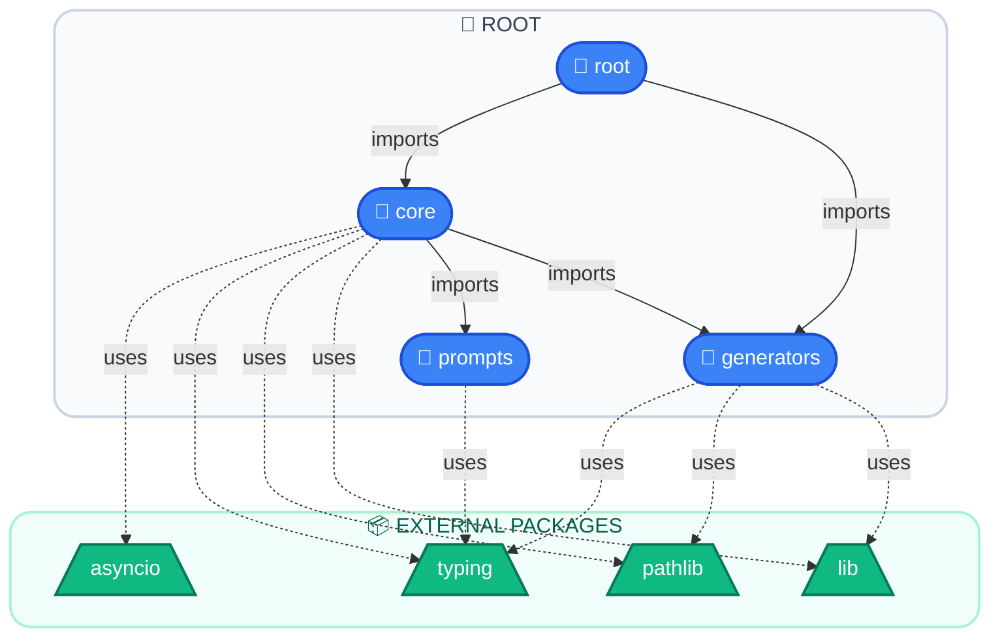

# 📦 Dependency Chain — `autodocs`
> Generated: 2026-05-17T11:11:09.350820Z

## 📊 Summary

| Metric | Value |
|--------|-------|
| Total Modules | **4** |
| Internal Dependencies | **9** |
| External Packages | **4** |
| Architecture Layers | **1** |

## 🏗️ Architecture Diagram

## 🎨 Legend

| Color | Layer |
|-------|-------|
| 🔵 Blue | Core entry points |
| 🟣 Purple | Library modules |
| 🩷 Pink | Test suites |
| 🟢 Green | External packages |

## 📁 Module Reference

| Module | Source Path |
|--------|------------|
| `core` | `core.py` |
| `generators` | `generators.py` |
| `prompts` | `prompts.py` |
| `root` | `__init__.py` |

---
*Made with IBM Bob — BobSuite Visualizer Engine*