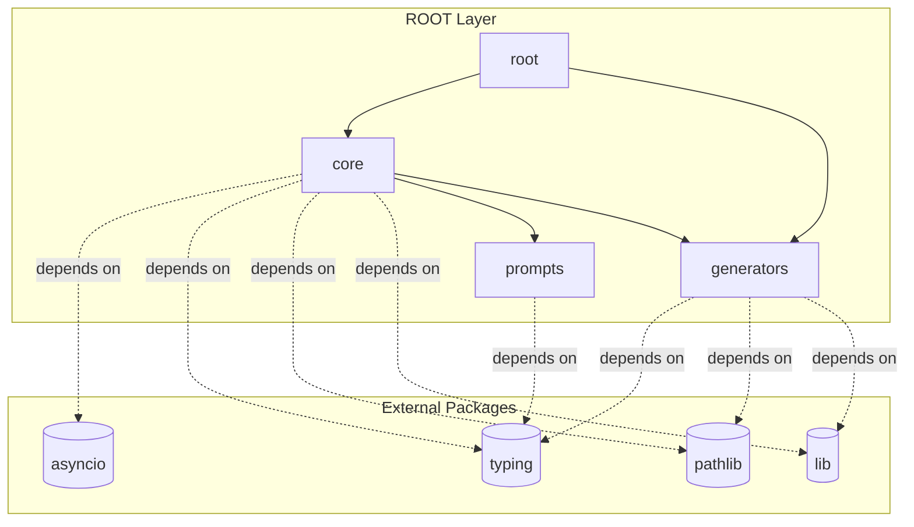

# 📦 Dependency Chain Map
**Root Directory:** `autodocs`
**Analysis Time:** 2026-05-17T10:34:51.313541Z

## System Architecture

## Module Explanations
- **core** maps out to source path location: `core.py`
- **generators** maps out to source path location: `generators.py`
- **prompts** maps out to source path location: `prompts.py`
- **root** maps out to source path location: `__init__.py`