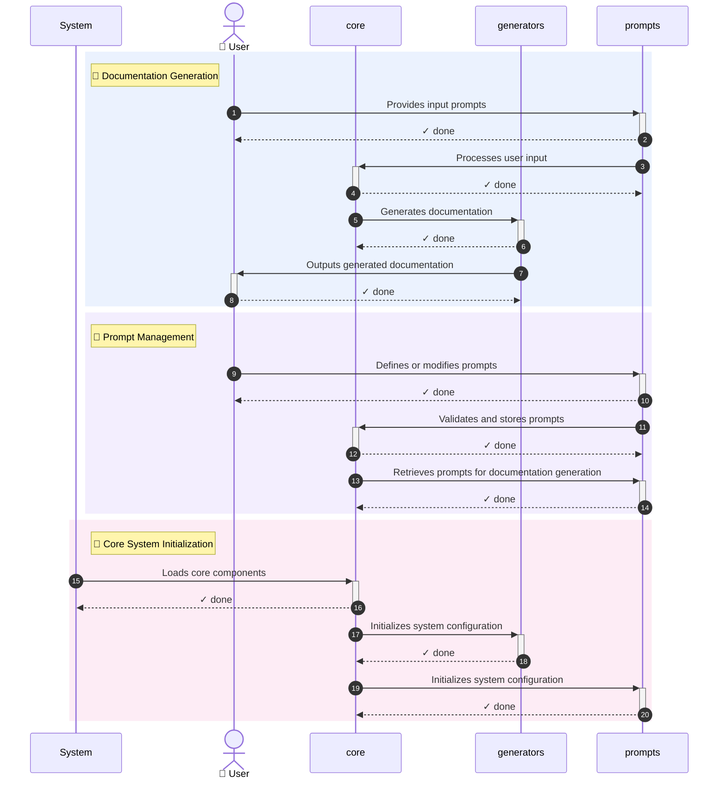

# 🔄 Feature Flow Map — `autodocs`
> Generated: 2026-05-17T11:11:27.380891Z

## 📊 Summary

**Features Analyzed:** 3

## 🔀 Execution Sequence

## 📋 Feature Details

### 1. Documentation Generation
- **Description:** Generates documentation based on user prompts and templates
- **Entry Point:** `generators.py`
- **Flow Steps:** 4

### 2. Prompt Management
- **Description:** Manages user prompts and templates for documentation generation
- **Entry Point:** `prompts.py`
- **Flow Steps:** 3

### 3. Core System Initialization
- **Description:** Initializes the autodocs system and loads necessary components
- **Entry Point:** `__init__.py`
- **Flow Steps:** 3

---
*Made with IBM Bob — BobSuite Visualizer Engine*