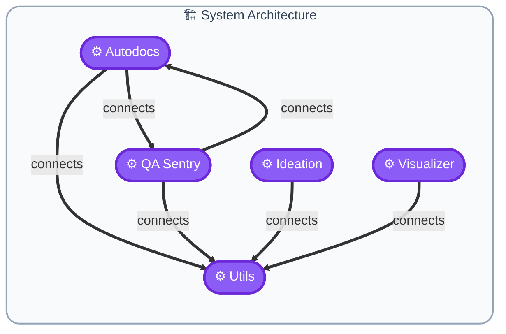

# 🗺️ Project Concept Map — `mcp_server`

## 📝 Overview

The MCP Server is a Python-based microservice that provides various functionalities including autodocs generation, QA Sentry for automated testing and issue tracking, ideation tools for product development, visualizers for data representation, and utility functions for caching, logging, and file operations.

## 📊 Summary

| Metric | Value |
|--------|-------|
| Components | **5** |
| External Services | **0** |
| Project Type | **Web App / Microservice** |

## 🏗️ Architecture Blueprint

## 🧩 Component Details

| Component | Type | Description |
|-----------|------|-------------|
| **Autodocs** | `server` | Generates API documentation and related documentation based on the codebase. |
| **QA Sentry** | `server` | Provides automated testing, issue tracking, and quality assurance functionalitie |
| **Ideation** | `server` | Tools and utilities for product ideation, including prompts, formatters, and val |
| **Visualizer** | `server` | Generates visual representations of data and provides usage guides and quickstar |
| **Utils** | `server` | Utility functions for caching, logging, file I/O, formatting, and constants. |

---
*Made with IBM Bob — BobSuite Visualizer Engine*