# 📦 Dependency Chain — `mcp_server`
> Generated: 2026-05-17T10:49:03.404031Z

## 📊 Summary

| Metric | Value |
|--------|-------|
| Total Modules | **45** |
| Internal Dependencies | **202** |
| External Packages | **24** |
| Architecture Layers | **4** |

## 🏗️ Architecture Diagram

```mermaid
%%{init: {'theme': 'default', 'themeVariables': { 'background': '#ffffff'}}}%%
graph TD
    subgraph Root [🔹 ROOT]
    direction TB
        server([🧩 server])
        watsonx_client([🧩 watsonx_client])
        lib([🧩 lib])
    end
    subgraph lib [🔹 LIB]
    direction TB
        lib_formatters([🧩 formatters])
        lib_autodocs_core([🧩 core])
        lib_autodocs_generators([🧩 generators])
        lib_autodocs_prompts([🧩 prompts])
        lib_autodocs([🧩 autodocs])
        lib_ideation_core([🧩 core])
        lib_ideation_formatters([🧩 formatters])
        lib_ideation_framework([🧩 framework])
        lib_ideation_prompts([🧩 prompts])
        lib_ideation_validators([🧩 validators])
        lib_ideation([🧩 ideation])
        lib_qa_sentry_agents([🧩 agents])
        lib_qa_sentry_auto_fixer([🧩 auto_fixer])
        lib_qa_sentry_chunking([🧩 chunking])
        lib_qa_sentry_core([🧩 core])
        lib_qa_sentry_parsers([🧩 parsers])
        lib_qa_sentry_prompts([🧩 prompts])
        lib_qa_sentry_reporting([🧩 reporting])
        lib_qa_sentry_test_generator([🧩 test_generator])
        lib_qa_sentry([🧩 qa_sentry])
        lib_utils_cache([🧩 cache])
        lib_utils_constants([🧩 constants])
        lib_utils_file_io([🧩 file_io])
        lib_utils_formatting([🧩 formatting])
        lib_utils_logging([🧩 logging])
        lib_utils([🧩 utils])
        lib_visualizer_core([🧩 core])
        lib_visualizer_prompts([🧩 prompts])
        lib_visualizer([🧩 visualizer])
    end
    subgraph tests [🔹 TESTS]
    direction TB
        tests_test_all([🧩 test_all])
        tests_test_all_doc_types([🧩 test_all_doc_types])
        tests_test_autodocs([🧩 test_autodocs])
        tests_test_cache_system([🧩 test_cache_system])
        tests_test_ideation([🧩 test_ideation])
        tests_test_ideation_integration([🧩 test_ideation_integration])
        tests_test_improvements([🧩 test_improvements])
        tests_test_performance_benchmarks([🧩 test_performance_benchmarks])
        tests_test_qa_sentry([🧩 test_qa_sentry])
        tests_test_qa_sentry_new_features([🧩 test_qa_sentry_new_features])
        tests_test_real_scan([🧩 test_real_scan])
        tests_test_watsonx([🧩 test_watsonx])
    end
    subgraph dataset_bob [🔹 DATASET BOB]
    direction TB
        dataset_bob_src_bob_core([🧩 bob_core])
    end
    subgraph External [📦 EXTERNAL PACKAGES]
    direction TB
        ext_traceback[/traceback\]
        ext_collections[/collections\]
        ext_os[/os\]
        ext_unittest[/unittest\]
        ext_httpx[/httpx\]
        ext_logging[/logging\]
        ext_json[/json\]
        ext_typing[/typing\]
        ext_io[/io\]
        ext_shutil[/shutil\]
        ext_tempfile[/tempfile\]
        ext_sys[/sys\]
        ext_asyncio[/asyncio\]
        ext_hashlib[/hashlib\]
        ext_re[/re\]
        ext_watsonx_client[/watsonx_client\]
        ext_dotenv[/dotenv\]
        ext_pathlib[/pathlib\]
        ext_time[/time\]
        ext_inspect[/inspect\]
        ext_ast[/ast\]
        ext_pytest[/pytest\]
        ext_datetime[/datetime\]
        ext_mcp[/mcp\]
    end
    server -.->|uses| ext_asyncio
    server -.->|uses| ext_json
    server -.->|uses| ext_sys
    server -.->|uses| ext_traceback
    server -.->|uses| ext_pathlib
    server -.->|uses| ext_typing
    server -.->|uses| ext_mcp
    server -.->|uses| ext_watsonx_client
    server -->|imports| lib
    watsonx_client -.->|uses| ext_os
    watsonx_client -.->|uses| ext_time
    watsonx_client -.->|uses| ext_asyncio
    watsonx_client -.->|uses| ext_typing
    watsonx_client -.->|uses| ext_httpx
    watsonx_client -.->|uses| ext_dotenv
    watsonx_client -->|imports| lib
    lib_formatters -.->|uses| ext_typing
    lib_formatters -.->|uses| ext_mcp
    tests_test_all -.->|uses| ext_asyncio
    tests_test_all -.->|uses| ext_json
    tests_test_all -.->|uses| ext_sys
    tests_test_all -.->|uses| ext_pathlib
    tests_test_all -.->|uses| ext_watsonx_client
    tests_test_all -->|imports| lib
    tests_test_all_doc_types -.->|uses| ext_asyncio
    tests_test_all_doc_types -.->|uses| ext_sys
    tests_test_all_doc_types -.->|uses| ext_pathlib
    tests_test_all_doc_types -->|imports| lib
    tests_test_all_doc_types -.->|uses| ext_watsonx_client
    tests_test_autodocs -.->|uses| ext_asyncio
    tests_test_autodocs -.->|uses| ext_sys
    tests_test_autodocs -.->|uses| ext_pathlib
    tests_test_autodocs -.->|uses| ext_watsonx_client
    tests_test_autodocs -->|imports| lib
    tests_test_cache_system -.->|uses| ext_pytest
    tests_test_cache_system -.->|uses| ext_asyncio
    tests_test_cache_system -.->|uses| ext_time
    tests_test_cache_system -.->|uses| ext_pathlib
    tests_test_cache_system -.->|uses| ext_tempfile
    tests_test_cache_system -.->|uses| ext_shutil
    tests_test_cache_system -->|imports| lib
    tests_test_ideation -.->|uses| ext_asyncio
    tests_test_ideation -.->|uses| ext_json
    tests_test_ideation -.->|uses| ext_pathlib
    tests_test_ideation -.->|uses| ext_sys
    tests_test_ideation -.->|uses| ext_watsonx_client
    tests_test_ideation -->|imports| lib
    tests_test_ideation_integration -.->|uses| ext_asyncio
    tests_test_ideation_integration -.->|uses| ext_json
    tests_test_ideation_integration -.->|uses| ext_pathlib
    tests_test_ideation_integration -.->|uses| ext_sys
    tests_test_ideation_integration -.->|uses| ext_datetime
    tests_test_ideation_integration -.->|uses| ext_watsonx_client
    tests_test_ideation_integration -->|imports| lib
    tests_test_improvements -.->|uses| ext_pytest
    tests_test_improvements -.->|uses| ext_asyncio
    tests_test_improvements -.->|uses| ext_time
    tests_test_improvements -.->|uses| ext_sys
    tests_test_improvements -.->|uses| ext_pathlib
    tests_test_improvements -.->|uses| ext_unittest
    tests_test_improvements -.->|uses| ext_tempfile
    tests_test_improvements -.->|uses| ext_watsonx_client
    tests_test_improvements -->|imports| lib
    tests_test_improvements -.->|uses| ext_httpx
    tests_test_improvements -.->|uses| ext_inspect
    tests_test_performance_benchmarks -.->|uses| ext_pytest
    tests_test_performance_benchmarks -.->|uses| ext_asyncio
    tests_test_performance_benchmarks -.->|uses| ext_time
    tests_test_performance_benchmarks -.->|uses| ext_tempfile
    tests_test_performance_benchmarks -.->|uses| ext_pathlib
    tests_test_performance_benchmarks -.->|uses| ext_unittest
    tests_test_performance_benchmarks -->|imports| lib
    tests_test_performance_benchmarks -.->|uses| ext_shutil
    tests_test_qa_sentry -.->|uses| ext_asyncio
    tests_test_qa_sentry -.->|uses| ext_json
    tests_test_qa_sentry -.->|uses| ext_sys
    tests_test_qa_sentry -.->|uses| ext_pathlib
    tests_test_qa_sentry -.->|uses| ext_watsonx_client
    tests_test_qa_sentry -->|imports| lib
    tests_test_qa_sentry_new_features -.->|uses| ext_asyncio
    tests_test_qa_sentry_new_features -.->|uses| ext_sys
    tests_test_qa_sentry_new_features -.->|uses| ext_pathlib
    tests_test_qa_sentry_new_features -.->|uses| ext_watsonx_client
    tests_test_qa_sentry_new_features -->|imports| lib
    tests_test_qa_sentry_new_features -.->|uses| ext_io
    tests_test_qa_sentry_new_features -.->|uses| ext_traceback
    tests_test_real_scan -.->|uses| ext_asyncio
    tests_test_real_scan -.->|uses| ext_sys
    tests_test_real_scan -.->|uses| ext_pathlib
    tests_test_real_scan -.->|uses| ext_watsonx_client
    tests_test_real_scan -->|imports| lib
    tests_test_watsonx -.->|uses| ext_asyncio
    tests_test_watsonx -.->|uses| ext_sys
    tests_test_watsonx -.->|uses| ext_pathlib
    tests_test_watsonx -.->|uses| ext_watsonx_client
    tests_test_watsonx -->|imports| lib
    lib_autodocs_core -.->|uses| ext_asyncio
    lib_autodocs_core -.->|uses| ext_typing
    lib_autodocs_core -.->|uses| ext_pathlib
    lib_autodocs_core -->|imports| lib
    lib_autodocs_core -->|imports| prompts
    lib_autodocs_core -->|imports| generators
    lib_autodocs_generators -.->|uses| ext_typing
    lib_autodocs_generators -.->|uses| ext_pathlib
    lib_autodocs_generators -->|imports| lib
    lib_autodocs_prompts -.->|uses| ext_typing
    lib_autodocs -->|imports| core
    lib_autodocs -->|imports| generators
    lib_ideation_core -.->|uses| ext_typing
    lib_ideation_core -->|imports| lib
    lib_ideation_core -.->|uses| ext_traceback
    lib_ideation_formatters -.->|uses| ext_typing
    lib_ideation_formatters -.->|uses| ext_datetime
    lib_ideation_formatters -.->|uses| ext_pathlib
    lib_ideation_formatters -->|imports| lib
    lib_ideation_framework -.->|uses| ext_typing
    lib_ideation_prompts -.->|uses| ext_typing
    lib_ideation_validators -.->|uses| ext_typing
    lib_ideation_validators -->|imports| lib
    lib_ideation -->|imports| lib
    lib_qa_sentry_agents -.->|uses| ext_json
    lib_qa_sentry_agents -.->|uses| ext_typing
    lib_qa_sentry_agents -->|imports| lib
    lib_qa_sentry_auto_fixer -.->|uses| ext_ast
    lib_qa_sentry_auto_fixer -.->|uses| ext_typing
    lib_qa_sentry_auto_fixer -->|imports| lib
    lib_qa_sentry_chunking -.->|uses| ext_asyncio
    lib_qa_sentry_chunking -.->|uses| ext_typing
    lib_qa_sentry_chunking -->|imports| lib
    lib_qa_sentry_core -.->|uses| ext_asyncio
    lib_qa_sentry_core -.->|uses| ext_pathlib
    lib_qa_sentry_core -.->|uses| ext_typing
    lib_qa_sentry_core -->|imports| lib
    lib_qa_sentry_core -.->|uses| ext_traceback
    lib_qa_sentry_parsers -.->|uses| ext_json
    lib_qa_sentry_parsers -.->|uses| ext_re
    lib_qa_sentry_parsers -.->|uses| ext_typing
    lib_qa_sentry_prompts -.->|uses| ext_typing
    lib_qa_sentry_prompts -.->|uses| ext_json
    lib_qa_sentry_reporting -.->|uses| ext_typing
    lib_qa_sentry_reporting -->|imports| lib
    lib_qa_sentry_test_generator -.->|uses| ext_json
    lib_qa_sentry_test_generator -.->|uses| ext_pathlib
    lib_qa_sentry_test_generator -.->|uses| ext_typing
    lib_qa_sentry_test_generator -->|imports| lib
    lib_qa_sentry -->|imports| lib
    lib_utils_cache -.->|uses| ext_hashlib
    lib_utils_cache -.->|uses| ext_json
    lib_utils_cache -.->|uses| ext_pathlib
    lib_utils_cache -.->|uses| ext_typing
    lib_utils_cache -.->|uses| ext_datetime
    lib_utils_cache -->|imports| lib
    lib_utils_file_io -.->|uses| ext_pathlib
    lib_utils_file_io -.->|uses| ext_typing
    lib_utils_file_io -->|imports| lib
    lib_utils_formatting -.->|uses| ext_datetime
    lib_utils_logging -.->|uses| ext_sys
    lib_utils_logging -.->|uses| ext_logging
    lib_utils_logging -.->|uses| ext_datetime
    lib_utils_logging -.->|uses| ext_pathlib
    lib_utils_logging -.->|uses| ext_typing
    lib_utils -->|imports| lib
    lib_visualizer_core -.->|uses| ext_ast
    lib_visualizer_core -.->|uses| ext_re
    lib_visualizer_core -.->|uses| ext_json
    lib_visualizer_core -.->|uses| ext_pathlib
    lib_visualizer_core -.->|uses| ext_typing
    lib_visualizer_core -.->|uses| ext_collections
    lib_visualizer_core -->|imports| lib
    lib_visualizer_prompts -.->|uses| ext_typing
    lib_visualizer -->|imports| lib
    dataset_bob_src_bob_core -.->|uses| ext_time

    classDef coreNode fill:#3b82f6,stroke:#1d4ed8,stroke-width:2px,color:#fff,rx:12
    classDef libNode fill:#8b5cf6,stroke:#6d28d9,stroke-width:2px,color:#fff,rx:12
    classDef testNode fill:#ec4899,stroke:#be185d,stroke-width:2px,color:#fff,rx:12
    classDef extNode fill:#10b981,stroke:#047857,stroke-width:2px,color:#fff,rx:8
    class server coreNode
    class watsonx_client coreNode
    class lib coreNode
    class lib_formatters libNode
    class lib_autodocs_core libNode
    class lib_autodocs_generators libNode
    class lib_autodocs_prompts libNode
    class lib_autodocs libNode
    class lib_ideation_core libNode
    class lib_ideation_formatters libNode
    class lib_ideation_framework libNode
    class lib_ideation_prompts libNode
    class lib_ideation_validators libNode
    class lib_ideation libNode
    class lib_qa_sentry_agents libNode
    class lib_qa_sentry_auto_fixer libNode
    class lib_qa_sentry_chunking libNode
    class lib_qa_sentry_core libNode
    class lib_qa_sentry_parsers libNode
    class lib_qa_sentry_prompts libNode
    class lib_qa_sentry_reporting libNode
    class lib_qa_sentry_test_generator libNode
    class lib_qa_sentry libNode
    class lib_utils_cache libNode
    class lib_utils_constants libNode
    class lib_utils_file_io libNode
    class lib_utils_formatting libNode
    class lib_utils_logging libNode
    class lib_utils libNode
    class lib_visualizer_core libNode
    class lib_visualizer_prompts libNode
    class lib_visualizer libNode
    class tests_test_all testNode
    class tests_test_all_doc_types testNode
    class tests_test_autodocs testNode
    class tests_test_cache_system testNode
    class tests_test_ideation testNode
    class tests_test_ideation_integration testNode
    class tests_test_improvements testNode
    class tests_test_performance_benchmarks testNode
    class tests_test_qa_sentry testNode
    class tests_test_qa_sentry_new_features testNode
    class tests_test_real_scan testNode
    class tests_test_watsonx testNode
    class dataset_bob_src_bob_core libNode
    class ext_traceback extNode
    class ext_collections extNode
    class ext_os extNode
    class ext_unittest extNode
    class ext_httpx extNode
    class ext_logging extNode
    class ext_json extNode
    class ext_typing extNode
    class ext_io extNode
    class ext_shutil extNode
    class ext_tempfile extNode
    class ext_sys extNode
    class ext_asyncio extNode
    class ext_hashlib extNode
    class ext_re extNode
    class ext_watsonx_client extNode
    class ext_dotenv extNode
    class ext_pathlib extNode
    class ext_time extNode
    class ext_inspect extNode
    class ext_ast extNode
    class ext_pytest extNode
    class ext_datetime extNode
    class ext_mcp extNode

    style Root fill:#f8fafc,stroke:#cbd5e1,stroke-width:2px,color:#334155,rx:16
    style lib fill:#f1f5f9,stroke:#94a3b8,stroke-width:2px,color:#334155,rx:16
    style tests fill:#fdf2f8,stroke:#fbcfe8,stroke-width:2px,color:#831843,rx:16
    style dataset_bob fill:#f0fdf4,stroke:#bbf7d0,stroke-width:2px,color:#166534,rx:16
    style External fill:#f0fdfa,stroke:#a7f3d0,stroke-width:2px,color:#065f46,rx:16
```

## 🎨 Legend

| Color | Layer |
|-------|-------|
| 🔵 Blue | Core entry points |
| 🟣 Purple | Library modules |
| 🩷 Pink | Test suites |
| 🟢 Green | External packages |

## 📁 Module Reference

| Module | Source Path |
|--------|------------|
| `dataset_bob.src.bob_core` | `dataset_bob\src\bob_core.py` |
| `lib` | `lib\__init__.py` |
| `lib.autodocs` | `lib\autodocs\__init__.py` |
| `lib.autodocs.core` | `lib\autodocs\core.py` |
| `lib.autodocs.generators` | `lib\autodocs\generators.py` |
| `lib.autodocs.prompts` | `lib\autodocs\prompts.py` |
| `lib.formatters` | `lib\formatters.py` |
| `lib.ideation` | `lib\ideation\__init__.py` |
| `lib.ideation.core` | `lib\ideation\core.py` |
| `lib.ideation.formatters` | `lib\ideation\formatters.py` |
| `lib.ideation.framework` | `lib\ideation\framework.py` |
| `lib.ideation.prompts` | `lib\ideation\prompts.py` |
| `lib.ideation.validators` | `lib\ideation\validators.py` |
| `lib.qa_sentry` | `lib\qa_sentry\__init__.py` |
| `lib.qa_sentry.agents` | `lib\qa_sentry\agents.py` |
| `lib.qa_sentry.auto_fixer` | `lib\qa_sentry\auto_fixer.py` |
| `lib.qa_sentry.chunking` | `lib\qa_sentry\chunking.py` |
| `lib.qa_sentry.core` | `lib\qa_sentry\core.py` |
| `lib.qa_sentry.parsers` | `lib\qa_sentry\parsers.py` |
| `lib.qa_sentry.prompts` | `lib\qa_sentry\prompts.py` |
| `lib.qa_sentry.reporting` | `lib\qa_sentry\reporting.py` |
| `lib.qa_sentry.test_generator` | `lib\qa_sentry\test_generator.py` |
| `lib.utils` | `lib\utils\__init__.py` |
| `lib.utils.cache` | `lib\utils\cache.py` |
| `lib.utils.constants` | `lib\utils\constants.py` |
| `lib.utils.file_io` | `lib\utils\file_io.py` |
| `lib.utils.formatting` | `lib\utils\formatting.py` |
| `lib.utils.logging` | `lib\utils\logging.py` |
| `lib.visualizer` | `lib\visualizer\__init__.py` |
| `lib.visualizer.core` | `lib\visualizer\core.py` |
| `lib.visualizer.prompts` | `lib\visualizer\prompts.py` |
| `server` | `server.py` |
| `tests.test_all` | `tests\test_all.py` |
| `tests.test_all_doc_types` | `tests\test_all_doc_types.py` |
| `tests.test_autodocs` | `tests\test_autodocs.py` |
| `tests.test_cache_system` | `tests\test_cache_system.py` |
| `tests.test_ideation` | `tests\test_ideation.py` |
| `tests.test_ideation_integration` | `tests\test_ideation_integration.py` |
| `tests.test_improvements` | `tests\test_improvements.py` |
| `tests.test_performance_benchmarks` | `tests\test_performance_benchmarks.py` |
| `tests.test_qa_sentry` | `tests\test_qa_sentry.py` |
| `tests.test_qa_sentry_new_features` | `tests\test_qa_sentry_new_features.py` |
| `tests.test_real_scan` | `tests\test_real_scan.py` |
| `tests.test_watsonx` | `tests\test_watsonx.py` |
| `watsonx_client` | `watsonx_client.py` |

---
*Made with IBM Bob — BobSuite Visualizer Engine*