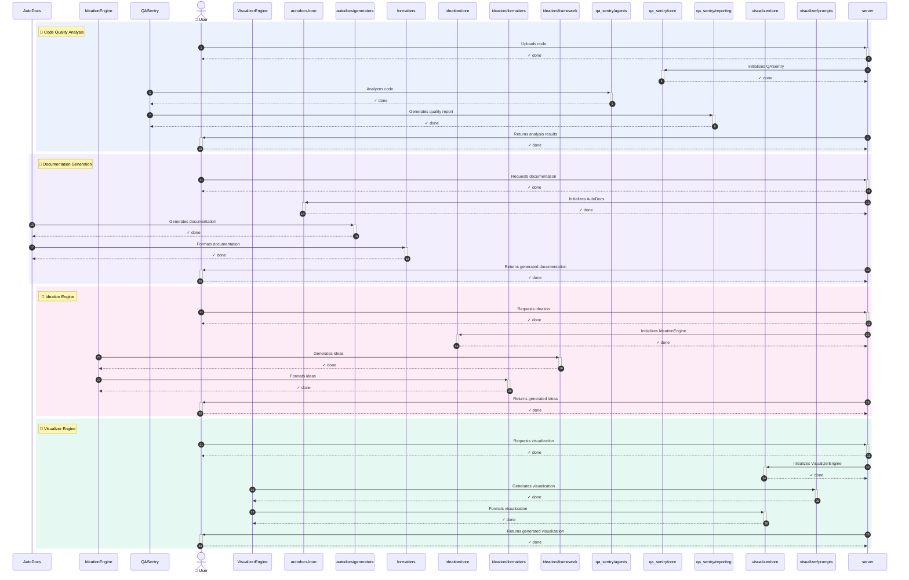

# 🔄 Feature Flow Map — `mcp_server`
> Generated: 2026-05-17T10:49:12.619423Z

## 📊 Summary

**Features Analyzed:** 4

## 🔀 Execution Sequence

## 📋 Feature Details

### 1. Code Quality Analysis
- **Description:** Analyzes code quality using IBM watsonx.ai and Sentry
- **Entry Point:** `server.py`
- **Flow Steps:** 5

### 2. Documentation Generation
- **Description:** Generates documentation using IBM watsonx.ai
- **Entry Point:** `server.py`
- **Flow Steps:** 5

### 3. Ideation Engine
- **Description:** Generates ideas and implementations using IBM watsonx.ai
- **Entry Point:** `server.py`
- **Flow Steps:** 5

### 4. Visualizer Engine
- **Description:** Visualizes code and documentation using IBM watsonx.ai
- **Entry Point:** `server.py`
- **Flow Steps:** 5

---
*Made with IBM Bob — BobSuite Visualizer Engine*