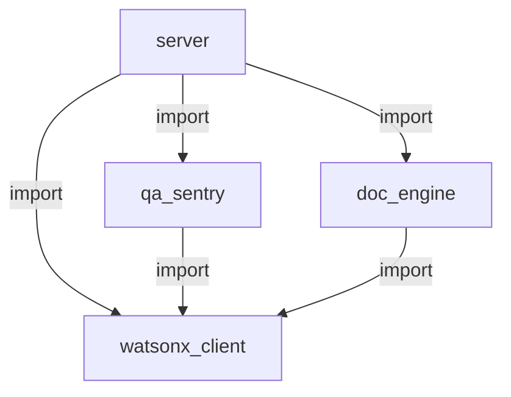
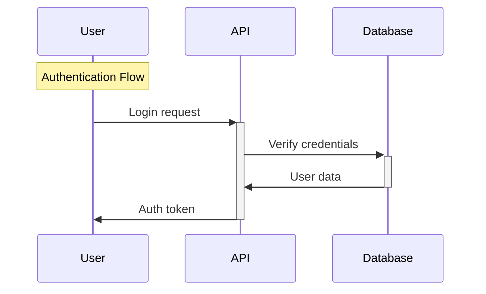
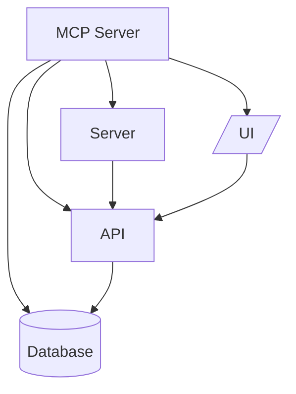

# Visualizer Engine - Usage Guide

## 🎯 Overview

The Visualizer Engine automatically generates visual diagrams to help new contributors quickly understand your project structure. It creates three types of visualizations:

1. **Dependency Chain** - Shows module relationships and imports
2. **Feature Flow Maps** - Illustrates user journeys and data flows
3. **Project Concept Maps** - Displays high-level architecture

All diagrams are generated as **Mermaid diagrams** embedded in markdown, which render beautifully in GitHub, VS Code, and other markdown viewers.

---

## 🚀 Quick Start

### Prerequisites

- IBM Bob IDE with BobSuite MCP configured
- IBM watsonx.ai credentials set up
- Python 3.8+ with required dependencies

### Testing the Visualizer

Run the test suite to verify everything works:

```bash
cd mcp_server
python test_visualizer.py
```

This will generate sample visualizations in `mcp_server/test_outputs/`.

---

## 📊 Tool 1: Dependency Chain

### What It Does

Analyzes your project's import statements and creates a visual graph showing:
- Which modules depend on which
- Internal vs external dependencies
- Module hierarchy and relationships

### When to Use

- **Onboarding new developers** - Help them understand the codebase structure
- **Refactoring** - Identify tightly coupled modules
- **Documentation** - Include in your project README
- **Code reviews** - Visualize impact of changes

### Usage in IBM Bob

```
Bob, generate a dependency chain for the mcp_server directory
```

With options:
```
Bob, generate a dependency chain for mcp_server with max_depth 2 and include external dependencies
```

### Parameters

| Parameter | Type | Required | Default | Description |
|-----------|------|----------|---------|-------------|
| `project_path` | string | Yes | - | Root directory to analyze |
| `output_path` | string | No | None | Where to save the markdown file |
| `max_depth` | integer | No | 3 | How deep to traverse dependencies |
| `include_external` | boolean | No | false | Include external library dependencies |

### Example Output



### Tips

- Start with `max_depth=2` for large projects to avoid overwhelming diagrams
- Use `include_external=true` to see which external libraries are most used
- Save to a `docs/` or `visualizations/` directory for easy access

---

## 🔄 Tool 2: Feature Flow Maps

### What It Does

Uses AI to analyze your codebase and create sequence diagrams showing:
- How features flow through the system
- User interaction points
- Data flow between components
- Step-by-step execution paths

### When to Use

- **Feature documentation** - Show how a feature works end-to-end
- **Bug investigation** - Trace the flow to find where issues occur
- **Planning** - Understand existing flows before adding new features
- **Training** - Help new team members understand user journeys

### Usage in IBM Bob

```
Bob, generate a feature flow map for the dataset_balancia project
```

For a specific feature:
```
Bob, generate a feature flow for dataset_balancia focusing on the authentication feature
```

### Parameters

| Parameter | Type | Required | Default | Description |
|-----------|------|----------|---------|-------------|
| `project_path` | string | Yes | - | Root directory to analyze |
| `feature_name` | string | No | None | Specific feature to focus on |
| `output_path` | string | No | None | Where to save the markdown file |

### Example Output



### Tips

- Let AI analyze all features first, then focus on specific ones
- This tool uses AI, so it may take 10-30 seconds to generate
- Review the output and refine by specifying feature names
- Great for creating user stories and acceptance criteria

---

## 🏗️ Tool 3: Project Concept Maps

### What It Does

Uses AI to understand your project architecture and creates a high-level diagram showing:
- Main architectural components (Server, Database, API, UI, etc.)
- How components connect
- External service integrations
- Overall system design

### When to Use

- **Project README** - Give visitors a bird's-eye view
- **Architecture reviews** - Discuss system design
- **Onboarding** - First thing new developers should see
- **Planning** - Understand current architecture before changes

### Usage in IBM Bob

```
Bob, generate a project concept map for the entire bobsuite project
```

With custom output:
```
Bob, create a project concept visualization for mcp_server and save it to docs/architecture.md
```

### Parameters

| Parameter | Type | Required | Default | Description |
|-----------|------|----------|---------|-------------|
| `project_path` | string | Yes | - | Root directory to analyze |
| `output_path` | string | No | None | Where to save the markdown file |

### Example Output



### Tips

- Run this first when exploring a new project
- AI determines component types automatically
- Include in your main README.md for maximum visibility
- Update periodically as architecture evolves

---

## 🎨 Understanding Mermaid Diagrams

All visualizations use Mermaid syntax, which renders automatically in:

- ✅ GitHub (in README.md, issues, PRs)
- ✅ VS Code (with Markdown Preview Mermaid Support extension)
- ✅ GitLab
- ✅ Notion
- ✅ Obsidian
- ✅ Many other markdown viewers

### Viewing Diagrams

**In GitHub:**
Just push the markdown file - diagrams render automatically!

**In VS Code:**
1. Install "Markdown Preview Mermaid Support" extension
2. Open the markdown file
3. Click the preview button (Ctrl+Shift+V)

**Online:**
Copy the mermaid code to [mermaid.live](https://mermaid.live) for instant preview

---

## 💡 Best Practices

### 1. Create a Visualizations Directory

```bash
mkdir -p docs/visualizations
```

Then save all diagrams there:
```
Bob, generate dependency chain for mcp_server and save to docs/visualizations/
```

### 2. Update Regularly

Run visualizations after major changes:
- New features added
- Architecture refactored
- Dependencies changed

### 3. Include in Documentation

Add to your README.md:
```markdown
## Architecture

See our [Project Concept Map](docs/visualizations/project-concept.md) for an overview.

## Dependencies

Check the [Dependency Chain](docs/visualizations/dependency-chain.md) to understand module relationships.
```

### 4. Use in Code Reviews

Generate visualizations before and after major changes to show impact.

### 5. Onboarding Checklist

For new team members:
1. ✅ Read README
2. ✅ Review Project Concept Map
3. ✅ Study Dependency Chain
4. ✅ Explore Feature Flow Maps
5. ✅ Start coding!

---

## 🔧 Troubleshooting

### "Project path does not exist"

**Solution:** Use absolute paths or paths relative to your current directory.

```
# Good
Bob, generate dependency chain for ./mcp_server

# Also good
Bob, generate dependency chain for /full/path/to/mcp_server
```

### Diagrams not rendering

**Solution:** Ensure you're viewing in a Mermaid-compatible viewer:
- GitHub: Works automatically
- VS Code: Install "Markdown Preview Mermaid Support"
- Local: Use [mermaid.live](https://mermaid.live)

### AI analysis taking too long

**Solution:** 
- Feature flow and concept maps use AI, which can take 10-30 seconds
- Dependency chains are fast (no AI needed)
- Check your internet connection
- Verify watsonx.ai credentials

### Empty or minimal diagrams

**Solution:**
- Ensure the project has actual code files
- For dependency chains, check that files have import statements
- For feature/concept maps, ensure README or main files exist

---

## 📚 Advanced Usage

### Combining Multiple Visualizations

Create a complete documentation set:

```bash
# 1. Generate all three types
Bob, generate dependency chain for mcp_server and save to docs/viz/
Bob, generate feature flow for mcp_server and save to docs/viz/
Bob, generate project concept for mcp_server and save to docs/viz/

# 2. Create an index
# docs/viz/README.md
```

### Custom Analysis Depth

For large projects, control detail level:

```
# High-level overview (fast)
Bob, generate dependency chain for mcp_server with max_depth 1

# Detailed analysis (slower)
Bob, generate dependency chain for mcp_server with max_depth 5 and include external dependencies
```

### Focusing on Specific Features

When you have many features:

```
# First, see all features
Bob, generate feature flow for dataset_balancia

# Then focus on one
Bob, generate feature flow for dataset_balancia focusing on authentication
```

---

## 🎯 Real-World Examples

### Example 1: New Developer Onboarding

**Scenario:** A new developer joins your team.

**Steps:**
1. Generate project concept map → Save to `docs/ARCHITECTURE.md`
2. Generate dependency chain → Save to `docs/DEPENDENCIES.md`
3. Generate feature flows → Save to `docs/FEATURES.md`
4. Add links to main README.md
5. New developer reads these first!

### Example 2: Refactoring Planning

**Scenario:** You want to refactor the authentication module.

**Steps:**
1. Generate dependency chain to see what depends on auth
2. Generate feature flow for authentication to understand current flow
3. Plan changes based on visualizations
4. After refactoring, regenerate to show improvements

### Example 3: Documentation Sprint

**Scenario:** Your project lacks documentation.

**Steps:**
1. Run all three visualization tools
2. Save outputs to `docs/` directory
3. Add to README with brief explanations
4. Instant professional documentation!

---

## 🤝 Contributing

Found a bug or have a feature request? The visualizer is part of BobSuite MCP.

### Extending the Visualizer

The code is modular and easy to extend:

- **Add new diagram types:** Extend `VisualizerEngine` class
- **Improve AI prompts:** Edit prompt templates in `core.py`
- **Support new languages:** Add parsers in `_parse_imports()`

---

## 📖 Additional Resources

- [Mermaid Documentation](https://mermaid.js.org/)
- [BobSuite MCP Architecture](../ARCHITECTURE.md)
- [IBM watsonx.ai Docs](https://www.ibm.com/docs/en/watsonx-as-a-service)

---

**Generated by BobSuite Visualizer Engine** 🚀