# 📦 Dependency Chain Map
**Root Directory:** `mcp_server`
**Analysis Time:** 2026-05-16T15:57:02.443360Z

## System Architecture

```mermaid
graph TD
    subgraph Root [ROOT Layer]
        generate_concept[generate_concept]
        server[server]
        test_ideation[test_ideation]
        test_ideation_integration[test_ideation_integration]
        test_qa_sentry[test_qa_sentry]
        test_real_scan[test_real_scan]
        test_visualizer[test_visualizer]
        test_watsonx[test_watsonx]
        watsonx_client[watsonx_client]
        lib[lib]
    end
    subgraph lib [LIB Layer]
        lib_doc_engine[doc_engine]
        lib_ideation[ideation]
        lib_qa_sentry[qa_sentry]
        lib_utils[utils]
        lib_visualizer[visualizer]
    end
    subgraph External [External Packages]
        ext_asyncio[(asyncio)]
        ext_httpx[(httpx)]
        ext_watsonx_client[(watsonx_client)]
        ext_os[(os)]
        ext_time[(time)]
        ext_datetime[(datetime)]
        ext_typing[(typing)]
        ext_pathlib[(pathlib)]
        ext_dotenv[(dotenv)]
        ext_mcp[(mcp)]
        ext_json[(json)]
        ext_sys[(sys)]
    end
    generate_concept -.->|depends on| ext_asyncio
    generate_concept -.->|depends on| ext_sys
    generate_concept -.->|depends on| ext_pathlib
    generate_concept -.->|depends on| ext_watsonx_client
    generate_concept --> lib
    server -.->|depends on| ext_asyncio
    server -.->|depends on| ext_json
    server -.->|depends on| ext_sys
    server -.->|depends on| ext_pathlib
    server -.->|depends on| ext_typing
    server -.->|depends on| ext_mcp
    server -.->|depends on| ext_watsonx_client
    server --> lib
    test_ideation -.->|depends on| ext_asyncio
    test_ideation -.->|depends on| ext_json
    test_ideation -.->|depends on| ext_pathlib
    test_ideation -.->|depends on| ext_sys
    test_ideation -.->|depends on| ext_watsonx_client
    test_ideation --> lib
    test_ideation_integration -.->|depends on| ext_asyncio
    test_ideation_integration -.->|depends on| ext_json
    test_ideation_integration -.->|depends on| ext_pathlib
    test_ideation_integration -.->|depends on| ext_sys
    test_ideation_integration -.->|depends on| ext_datetime
    test_ideation_integration -.->|depends on| ext_watsonx_client
    test_ideation_integration --> lib
    test_qa_sentry -.->|depends on| ext_asyncio
    test_qa_sentry -.->|depends on| ext_json
    test_qa_sentry -.->|depends on| ext_sys
    test_qa_sentry -.->|depends on| ext_pathlib
    test_qa_sentry -.->|depends on| ext_watsonx_client
    test_qa_sentry --> lib
    test_real_scan -.->|depends on| ext_asyncio
    test_real_scan -.->|depends on| ext_sys
    test_real_scan -.->|depends on| ext_pathlib
    test_real_scan -.->|depends on| ext_watsonx_client
    test_real_scan --> lib
    test_visualizer -.->|depends on| ext_asyncio
    test_visualizer -.->|depends on| ext_sys
    test_visualizer -.->|depends on| ext_pathlib
    test_visualizer -.->|depends on| ext_watsonx_client
    test_visualizer --> lib
    test_watsonx -.->|depends on| ext_asyncio
    test_watsonx -.->|depends on| ext_sys
    test_watsonx -.->|depends on| ext_pathlib
    test_watsonx -.->|depends on| ext_watsonx_client
    test_watsonx --> lib
    watsonx_client -.->|depends on| ext_os
    watsonx_client -.->|depends on| ext_time
    watsonx_client -.->|depends on| ext_typing
    watsonx_client -.->|depends on| ext_httpx
    watsonx_client -.->|depends on| ext_dotenv
    lib_doc_engine --> lib
    lib_ideation --> lib
    lib_qa_sentry --> lib
    lib_utils --> lib
    lib_visualizer --> lib
```

## Module Explanations
- **generate_concept** maps out to source path location: `generate_concept.py`
- **lib** maps out to source path location: `lib\__init__.py`
- **lib.doc_engine** maps out to source path location: `lib\doc_engine\__init__.py`
- **lib.ideation** maps out to source path location: `lib\ideation\__init__.py`
- **lib.qa_sentry** maps out to source path location: `lib\qa_sentry\__init__.py`
- **lib.utils** maps out to source path location: `lib\utils\__init__.py`
- **lib.visualizer** maps out to source path location: `lib\visualizer\__init__.py`
- **server** maps out to source path location: `server.py`
- **test_ideation** maps out to source path location: `test_ideation.py`
- **test_ideation_integration** maps out to source path location: `test_ideation_integration.py`
- **test_qa_sentry** maps out to source path location: `test_qa_sentry.py`
- **test_real_scan** maps out to source path location: `test_real_scan.py`
- **test_visualizer** maps out to source path location: `test_visualizer.py`
- **test_watsonx** maps out to source path location: `test_watsonx.py`
- **watsonx_client** maps out to source path location: `watsonx_client.py`