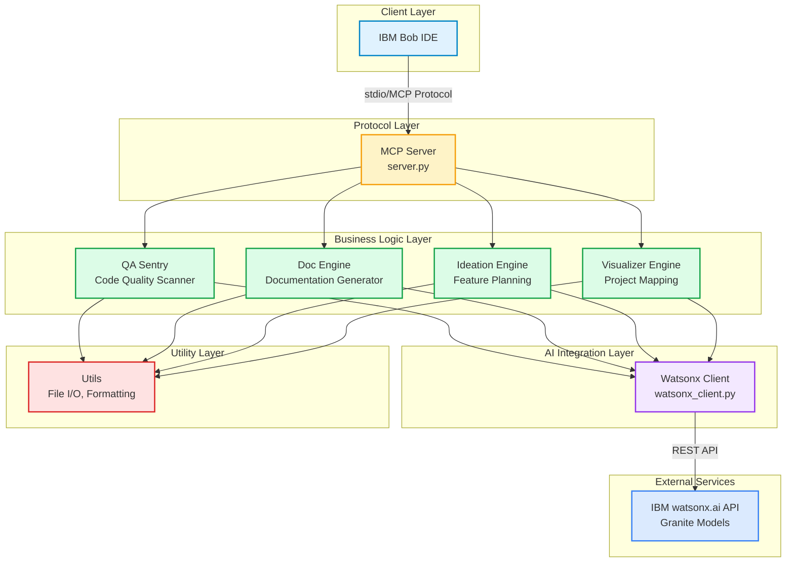

# 🗺️ BobSuite MCP Server - Structural Blueprint

**Project Platform:** `mcp_server`  
**Generated:** 2026-05-16  
**Type:** Python MCP Server with AI-Powered Code Analysis & Planning Tools

## Abstract Overview

BobSuite MCP Server is a comprehensive Model Context Protocol server that extends IBM Bob's capabilities with AI-powered code quality analysis, documentation generation, feature planning, and project visualization. It integrates with IBM watsonx.ai to provide intelligent development assistance throughout the entire software development lifecycle.

Note for VS Code Users: To view the architecture diagrams in this document properly, please install the Markdown Preview Mermaid Support extension by Matt Bierner.

## Concept Architecture Blueprint



## Component Details

### 1. **MCP Server** (`server.py`)
- **Type:** Protocol Handler
- **Responsibilities:**
  - Implements Model Context Protocol server
  - Registers and routes tool calls
  - Manages async communication with IBM Bob
  - Coordinates between business logic modules
- **Tools Exposed:**
  - `scan_code_quality` - Code analysis
  - `generate_documentation` - Doc generation
  - `scan_git_diff` - Git change scanning
  - `get_project_framework` - Ideation framework
  - `synthesize_project_plan` - PRD generation
  - `generate_dependency_chain` - Dependency visualization
  - `generate_feature_flow` - Feature flow mapping
  - `generate_project_concept` - Architecture visualization

### 2. **Watsonx Client** (`watsonx_client.py`)
- **Type:** AI Integration
- **Responsibilities:**
  - Manages IBM watsonx.ai API authentication
  - Provides text generation capabilities
  - Builds specialized prompts for different tasks
  - Handles error recovery and retries
- **Models Used:**
  - IBM Granite-4-h-small (default)
  - Configurable model selection
- **Key Features:**
  - Token-based authentication with caching
  - Async API calls
  - Specialized prompt builders for PRD synthesis

### 3. **QA Sentry** (`lib/qa_sentry/`)
- **Type:** Code Quality Analysis
- **Responsibilities:**
  - Scans code for bugs and vulnerabilities
  - Detects security issues
  - Identifies code quality problems
  - Supports 13+ programming languages
  - Generates structured reports
- **Capabilities:**
  - Single file scanning
  - Batch scanning
  - Git diff scanning
  - Auto-fix suggestions
  - Markdown report generation

### 4. **Doc Engine** (`lib/doc_engine/`)
- **Type:** Documentation Generator
- **Responsibilities:**
  - Generates inline comments and docstrings
  - Creates API reference documentation
  - Produces README sections
  - Generates comprehensive project docs
- **Documentation Types:**
  - Inline comments
  - API references
  - README files
  - Full documentation suites

### 5. **Ideation Engine** (`lib/ideation/`)
- **Type:** Feature Planning & PRD Generation
- **Responsibilities:**
  - Provides 7-pillar framework for feature planning
  - Conducts guided interviews with developers
  - Validates conversation completeness
  - Synthesizes professional PRDs using AI
  - Manages intelligent file output paths
- **7-Pillar Framework:**
  1. Description - What are we building?
  2. In Scope - What features are included?
  3. Out of Scope - What's excluded?
  4. Implementation - Technical approach
  5. Acceptance Criteria - Success metrics
  6. Timeline - Project phases
  7. Resources - Team, tools, budget
- **Key Features:**
  - AI-driven conversation flow
  - Flexible data format (JSON or transcript)
  - Quality validation
  - Dual output (chat + file)

### 6. **Visualizer Engine** (`lib/visualizer/`)
- **Type:** Project Visualization & Onboarding
- **Responsibilities:**
  - Generates dependency chain diagrams
  - Creates feature flow maps
  - Produces project concept visualizations
  - Outputs Mermaid diagrams in markdown
- **Visualization Types:**
  - **Dependency Chain:** Module relationships and imports
  - **Feature Flow:** User journeys and data flows
  - **Project Concept:** High-level architecture overview
- **Key Features:**
  - AST-based import parsing
  - AI-powered feature detection
  - Mermaid diagram generation
  - Automatic file organization

### 7. **Utils** (`lib/utils/`)
- **Type:** Utility Functions
- **Responsibilities:**
  - File I/O operations
  - Language detection
  - Content formatting
  - Timestamp generation
  - Safe file reading

## External Dependencies

### IBM watsonx.ai
- **Purpose:** AI model inference
- **Models:** IBM Granite series
- **Authentication:** API key + Project ID
- **Endpoint:** https://us-south.ml.cloud.ibm.com

### Python Packages
- `mcp` - Model Context Protocol
- `httpx` - Async HTTP client
- `python-dotenv` - Environment management

## Data Flow Patterns

### Code Analysis Flow
```
Bob → MCP Server → QA Sentry → Watsonx Client → IBM AI → Results → Bob
```

### Documentation Flow
```
Bob → MCP Server → Doc Engine → Watsonx Client → IBM AI → Docs → Bob
```

### Feature Planning Flow
```
Bob → Framework Request → Ideation Engine → Guided Interview → 
PRD Synthesis → Watsonx Client → IBM AI → PRD Document → Bob + File
```

### Visualization Flow
```
Bob → Visualization Request → Visualizer Engine → 
[AST Analysis OR AI Analysis] → Mermaid Diagram → Markdown → Bob + File
```

## Key Design Principles

1. **Modularity:** Each engine is independent and focused
2. **AI-First:** Leverages IBM watsonx.ai for intelligent analysis
3. **Protocol-Based:** Uses MCP for standardized communication
4. **Async-Ready:** All operations support async execution
5. **Error-Resilient:** Comprehensive error handling and fallbacks
6. **Developer-Friendly:** Clear APIs and extensive documentation

## File Organization

```
mcp_server/
├── server.py                    # MCP server entry point
├── watsonx_client.py           # AI integration
├── lib/
│   ├── qa_sentry/              # Code quality analysis
│   │   ├── core.py
│   │   ├── parsers.py
│   │   ├── auto_fixer.py
│   │   └── git_utils.py
│   ├── doc_engine/             # Documentation generation
│   │   ├── core.py
│   │   └── generators.py
│   ├── ideation/               # Feature planning
│   │   ├── core.py
│   │   ├── framework.py
│   │   ├── formatters.py
│   │   └── validators.py
│   ├── visualizer/             # Project visualization
│   │   └── core.py
│   └── utils/                  # Shared utilities
│       ├── constants.py
│       ├── file_io.py
│       └── formatting.py
└── test_outputs/               # Generated files
```

## Success Metrics

- **Code Quality:** Identifies bugs, vulnerabilities, and quality issues
- **Documentation:** Generates comprehensive, readable documentation
- **Planning:** Produces professional PRDs from conversations
- **Visualization:** Creates clear, informative project diagrams
- **Integration:** Seamlessly extends IBM Bob's capabilities
- **Performance:** Fast, reliable AI-powered analysis

This architecture transforms IBM Bob from a reactive coding assistant into a proactive development partner that supports the entire software development lifecycle.